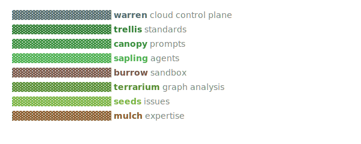

<p align="center">
  
</p>

# Terrarium

**Terrarium** is the graph analysis and dependency tree tool for the `os-eco` stack. It connects directly with `.seeds/issues.jsonl` to analyze task relationships, build visual dependency graphs, and automatically triage ready issues using network algorithms (PageRank, betweenness, critical paths).

## Usage

```bash
terrarium triage [options]   # Rank ready issues using graph algorithms
terrarium graph [options]    # Print a pretty tree of the dependency graph
```

See `terrarium --help` for all available options.

## Development

```bash
bun install
bun link
bun run lint
bun run typecheck
```

## Contributing

See [CONTRIBUTING.md](CONTRIBUTING.md) for development rules and how to submit pull requests.
